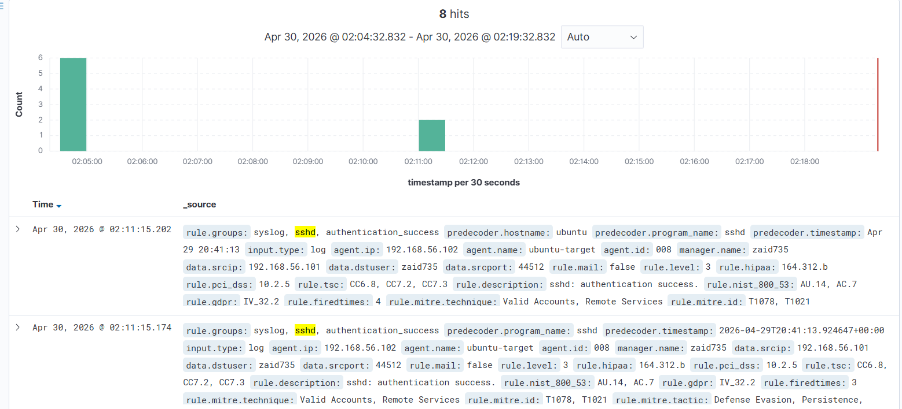
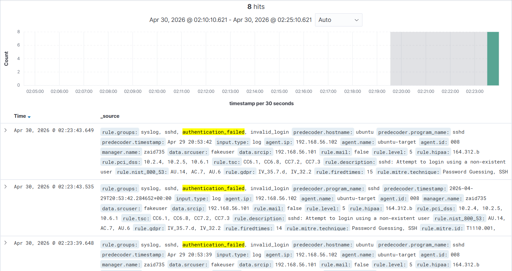
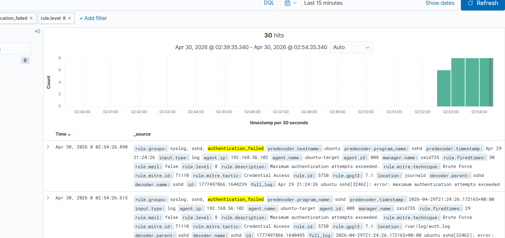

# SSH Brute Force Detection using Wazuh SIEM

## Objective
Simulate an SSH brute-force attack and detect it using Wazuh SIEM by analyzing repeated authentication failures and identifying attack patterns.

---

## Lab Environment

- **Attacker:** Kali Linux — 192.168.56.101  
- **Target:** Ubuntu Server (SSH + Fail2Ban) — 192.168.56.102  
- **SIEM:** Wazuh Manager — 192.168.56.104  

---

## Attack Simulation

A brute-force attack was performed using Hydra:

hydra -l fakeuser -P /usr/share/wordlists/rockyou.txt -t 1 ssh://192.168.56.102

## Log Generation

Failed login attempts were recorded on the target system:

/var/log/auth.log

Example log entry:

Failed password for invalid user fakeuser from 192.168.56.101
Detection using Wazuh
Level 5 Alert (Basic Event)
Triggered by a single failed login attempt
Indicates authentication failure
Not sufficient to confirm an attack
Level 8 Alert (Brute Force Detection)
Triggered after multiple failed attempts
Indicates repeated behavior (attack pattern)
High-confidence alert

Example:

Maximum authentication attempts exceeded
## Key Observation

Initially, Fail2Ban blocked the attacker after a few attempts:

Result → Only Level 5 alerts observed
No pattern formed → No escalation

After relaxing/disabling Fail2Ban:

More login attempts were allowed
Wazuh detected repeated failures
Alert escalated to Level 8 (Brute Force Detection)
MITRE ATT&CK Mapping
Technique: T1110 — Brute Force
Description: Repeated password guessing attempts to gain access
Detection Flow
Attack (Hydra)
    ↓
SSH Logs (/var/log/auth.log)
    ↓
Wazuh Agent (Log Collection)
    ↓
Wazuh Manager (Analysis)
    ↓
Alert Generation (Level 5 → Level 8)

## Screenshots

### SSH Failed Login Attempts

### Wazuh Level 5 Alert

### Wazuh Level 8 Alert

SSH failed login attempts
Wazuh Level 5 alert
Wazuh Level 8 alert
Fail2Ban ban status

## Key Learnings
Detection requires event volume and pattern recognition
Prevention tools (Fail2Ban) can limit detection visibility
SIEM systems correlate multiple events to detect real attacks
Understanding logs is more important than just running tools

## Conclusion

This lab demonstrates how SSH brute-force attacks can be detected using Wazuh SIEM by analyzing repeated authentication failures and correlating them into meaningful security alerts. It highlights the balance between detection (SIEM) and prevention (Fail2Ban) in a real-world security setup.
